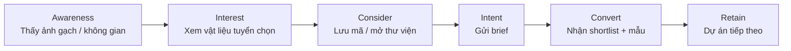

# 02 — Đối tượng mục tiêu

> Nguồn: `Plan triển khai` §1 (định vị), `src/lib/lp-types.ts` (`LP_PROJECT_TYPES`,
> `LP_PROJECT_STAGES`), `ProjectBriefForm.tsx` (field thật của lead), `mockData.ts`
> (application theo mã), `SPACE_TYPES` (`src/lib/types.ts`).

## 1. Khách hàng cốt lõi (ICP)

**ICP một câu:**

> **Kiến trúc sư / studio thiết kế** đang trong giai đoạn **lên concept hoặc thiết kế 3D**
> cho một công trình **nhà ở, hospitality hoặc F&B**, cần chọn **mã gạch cụ thể** cho
> tường/sàn theo bối cảnh, và cần **ảnh map + mẫu thật** để trình chủ đầu tư.

### Ranh giới ICP

| Trong ICP | Ngoài ICP (không tối ưu ads) |
|---|---|
| KTS, studio thiết kế nội–ngoại thất | Người mua lẻ 1–2 thùng |
| Chủ đầu tư có KTS tư vấn | Thợ thi công tự mua vật tư |
| Nhà thầu hoàn thiện có thiết kế | Khách tìm gạch giá rẻ đại trà |
| Nhà phân phối/đại lý cần nguồn | Người mua để đầu cơ |

> **Lưu ý:** khách lẻ vẫn có thể mua, nhưng **không phải đối tượng content/ads**. Nếu
> họ vào, form brief vẫn nhận — nhưng thông điệp không nhắm vào họ.

## 2. Chân dung (personas)

### Persona A — "KTS chủ trì" (ICP chính, ~60% ưu tiên)

| Thuộc tính | Mô tả |
|---|---|
| Vai trò | Kiến trúc sư / chủ trì thiết kế tại studio 5–30 người |
| Tuổi / kinh nghiệm | 28–45, 5–15 năm nghề |
| Địa bàn | TP.HCM và vệ tinh (Bình Dương, Đồng Nai, Long An); dự án tỉnh |
| Công cụ | SketchUp, 3ds Max, Revit, Enscape; Zalo/Facebook là kênh chính |
| Công việc | Lên concept → chọn vật liệu → dựng 3D → trình chủ đầu tư → bàn giao spec |
| **Đau** | Không có ảnh map để dựng 3D; phải chạy nhiều showroom; mã gạch không thống nhất giữa các nguồn; sợ chọn xong chủ đầu tư đổi |
| **Thắng** | Có shortlist + ảnh map + mẫu thật nhanh, đủ để chốt với chủ đầu tư |
| Kích hoạt | Bị chủ đầu tư hỏi "chọn gạch nào?"; đến giai đoạn 3D cần texture |
| Nơi ở online | Facebook (group KTS, nội thất), Pinterest, Behance, Zalo, TikTok KTS |
| Thông điệp ăn | "Ảnh map + mẫu thật, không phải bảng giá chung" |

### Persona B — "Studio/agency hoàn thiện" (~25%)

| Thuộc tính | Mô tả |
|---|---|
| Vai trò | Studio nội thất / công ty hoàn thiện trọn gói, có team design |
| Tuổi | 30–50, có 2–10 dự án song song |
| **Đau** | Cần nguồn gạch **ổn định & lặp lại** giữa nhiều dự án; cần báo giá nhanh theo hạng mục; cần spec kỹ thuật (R-value, độ dày) |
| **Thắng** | Nguồn hàng ổn, báo giá theo dự án, tư vấn số lượng đã trừ hao |
| Kích hoạt | Có dự án mới cần chốt vật liệu; cần đối chiếu giá nhà cung cấp |
| Nơi ở online | Facebook, LinkedIn, Zalo nhóm ngành, email |
| Thông điệp ăn | "Báo giá theo hạng mục + tư vấn số lượng trừ hao cắt ghép" |

### Persona C — "Chủ đầu tư có gu" (~15%)

| Thuộc tính | Mô tả |
|---|---|
| Vai trò | Chủ villa / homestay / quán cà phê, có KTS nhưng muốn tự kiểm soát thẩm mỹ |
| **Đau** | Không đọc được thông số kỹ thuật; sợ chọn sai màu ngoài ánh sáng thật |
| **Thắng** | Nhìn thấy vật liệu **trong không gian thực tế** trước khi quyết; được gửi mẫu thật |
| Kích hoạt | Đang xem ảnh không gian, moodboard; chuẩn bị chốt nội thất |
| Nơi ở online | Facebook, Instagram, Pinterest, TikTok |
| Thông điệp ăn | "Xem vật liệu trong không gian thực tế trước khi quyết" |

## 3. Phân khúc theo loại công trình

Từ `LP_PROJECT_TYPES` — dùng làm **segment ads** và **content track**:

| Loại công trình | Đặc điểm mua | Dòng gạch chủ đạo | Bối cảnh nội dung |
|---|---|---|---|
| **Nhà ở / Villa** | Volume lớn, 1 lần, kỹ tính | Ốp lát + gạch thẻ | Phòng khách, bếp, phòng tắm, sân |
| **Hospitality / Resort** | Volume rất lớn, chu kỳ dài | Mosaic + ốp lát + bông | Hồ bơi, spa, sảnh, phòng nghỉ |
| **F&B / Retail** | Chu kỳ ngắn, nhấn mạnh điểm nhấn | Mosaic + gạch thẻ | Quầy bar, backsplash, mặt tiền |
| **Văn phòng Studio** | Volume vừa, thẩm mỹ tối giản | Ốp lát + thẻ | Sảnh, phòng họp, pantry |
| **Công trình khác** | Đa dạng | Theo concept | — |

## 4. Phân khúc theo giai đoạn dự án

Từ `LP_PROJECT_STAGES` — quyết định **loại content** phù hợp (xem `04`):

| Giai đoạn | Khách cần gì | Content phù hợp | Ưu tiên chuyển đổi |
|---|---|---|---|
| **Đang lên concept** | Cảm hứng, moodboard, tông màu | Lookbook không gian, moodboard | Thu hút — mời lưu mã |
| **Đang thiết kế 3D** | **Ảnh map, texture, spec** | Ảnh map, "1 ảnh = 1 mã", spec | **Chuyển đổi cao** — mời mở thư viện |
| **Chuẩn bị thi công** | Báo giá, số lượng, tiến độ | Báo giá theo hạng mục, mẫu thật | **Chuyển đổi cao** — mời gửi brief |
| **Cần chốt gấp** | Phản hồi nhanh, mẫu nhanh | Cam kết 4h/24h | **Khẩn** — hotline/Zalo |

> **Insight quan trọng cho ads:** giai đoạn "**đang thiết kế 3D**" là điểm rơi vàng —
> khách cần ảnh map mà chỉ có thư viện mới cho được. Đây là lúc gate "Mở Thư viện mã gạch"
> có giá trị nhất.
>
> ⚠️ **Thực tế của gate:** trong trang **Thư viện mã gạch**, gate hiện **ngay cho mọi khách
> chưa đăng nhập** (`showUnlockGate = !isUnlocked`), **không** chờ khách xem hết 12 mã.
> Con số 12 chỉ là **số card hiển thị ở chế độ xem trước**, không phải ngưỡng kích hoạt.
> (Comment trong code nói "xem hết 12 mã" là **comment cũ, sai**.)

## 5. Hành trình khách hàng (customer journey)

| Bước | Chạm với brand | Câu hỏi trong đầu khách | Content/CTA phù hợp |
|---|---|---|---|
| **Awareness** | Ad Facebook/TikTok, bài Pinterest | "Có gạch nào cho concept này không?" | Ảnh không gian thực tế, hook cảm xúc |
| **Interest** | Hero LP, Vật liệu tuyển chọn | "Bề mặt này có hợp không?" | 12 mã tiêu biểu, 4 dòng gạch |
| **Consider** | Lookbook, Moodboard, Thư viện | "Mã này là gì, có ảnh map không?" | "1 ảnh = 1 mã", lưu shortlist |
| **Intent** | Form brief | "Họ có hiểu dự án mình không?" | Form 10 field (2 bắt buộc), cam kết 4h |
| **Convert** | Tư vấn qua Zalo/điện thoại | "Có đúng ý mình không?" | Shortlist có lý do, mẫu thật |
| **Retain** | Chăm sóc, dự án sau | "Lần sau gọi lại được không?" | Nhắc lại theo mùa dự án |

### Kênh theo từng bước

| Bước | Kênh chính | Ghi chú |
|---|---|---|
| Awareness | Facebook, TikTok, Pinterest | Ảnh là vũ khí chính |
| Interest | Landing page `/`, `/lp/gach-the`, `/lp/mosaic` | Đã có 3 biến thể |
| Consider | Thư viện mã gạch (gate), Lookbook | Gate hiện **ngay** với khách chưa đăng nhập, không chờ xem hết |
| Intent | Form brief trên LP | 10 field (Họ tên + SĐT bắt buộc) + shortlist đính kèm |
| Convert | Zalo OA / Messenger / điện thoại | `ChatWidget`, hotline 0909 888 951 |
| Retain | Zalo, email (nếu consent marketing) | `consent_marketing` tách khỏi cookie |
| Top (organic) | Pinterest | Kênh gom moodboard của persona A/C — tái dùng ảnh dọc từ P2/P4 |

## 6. Điều KHÔNG làm với audience

| ❌ Không | Vì |
|---|---|
| Target "người mua gạch" chung chung | Lãng phí ngân sách vào khách lẻ |
| Dùng ảnh nội thất chung chung làm creative | Không lọc được KTS vs khách lẻ |
| Gate ngay khi vào **trang chủ LP** | Trang chủ LP không gate; nhưng **trang Thư viện mã gạch thì gate hiện ngay** với khách chưa đăng nhập |
| Hứa giá trên ads | Không có giá công khai; gây kỳ vọng sai |
| Nhắm "chủ nhà đang xây" không có KTS | Ngoài ICP, chuyển đổi thấp |
| Target theo **chức danh** "kiến trúc sư" trên Meta | Meta đã bỏ job-title targeting — xem `06` §1 |

## 7. Câu hỏi phải trả lời được trước khi chạy camp

1. Nhóm này thuộc **persona nào** (A/B/C)?
2. Họ đang ở **giai đoạn nào** (4 giai đoạn trên)?
3. Creative có **mã gạch cụ thể** hoặc **bối cảnh cụ thể** chưa?
4. CTA dẫn tới đâu — lưu mã, mở thư viện, hay gửi brief?
5. UTM đã đặt theo chuẩn ở `06` chưa?
