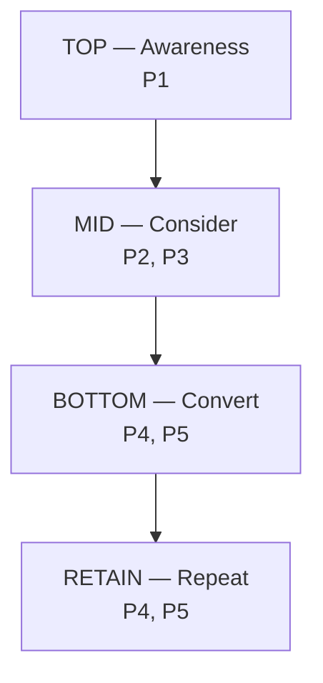

# 04 — Chiến lược nội dung

> Nguồn: `02-doi-tuong-muc-tieu.md` (journey, persona), `01-dinh-vi-thuong-hieu.md`
> (voice, pillar gốc), `src/lib/lp-content.ts` (3 slug LP — ⚠️ biến thể **chưa render**),
> `SPACE_TYPES`, `TONE_GROUPS`, `src/data/mockData.ts`.

## 1. Mục tiêu content (theo thứ tự ưu tiên)

| # | Mục tiêu | Chỉ số chính | Nhắm persona |
|---|---|---|---|
| 1 | **Tạo lead brief** (chuyển đổi) | Số `Lead` event + số lead `form_kind='lp'` trong `lp_leads` | A, B |
| 2 | **Mở khoá thư viện** (mid-funnel) | Số lead `form_kind='google-unlock'` `[CHƯA ĐO ĐƯỢC qua pixel]` | A (giai đoạn 3D) |
| 3 | **Lưu shortlist** (engagement) | Số `AddToCart` | A, C |
| 4 | **Nhận diện thương hiệu** (top) | Reach, `ViewContent` | A, B, C |

> ⚠️ **Mục tiêu 2 chưa đo được bằng event.** Luồng mở khoá thư viện đi qua Google OAuth và
> ghi thẳng `lp_leads`, **không** đi qua `trackEvent` — nên không có event nào để đo.
> Proxy duy nhất hiện có là **đếm lead `google-unlock` trong CRM**.

> **Nguyên tắc:** content không bán gạch — content **giúp chọn đúng mã**. Mọi bài
> phải dẫn được về một hành động: lưu mã / mở thư viện / gửi brief.

## 2. Năm content pillar

| # | Pillar | Trả lời câu hỏi của khách | Format chính | Funnel chính | Tần suất `[GIẢ ĐỊNH]` |
|---|---|---|---|---|---|
| **P1** | **Bề mặt & Chất liệu** | "Bề mặt này trông/cảm thế nào?" | Ảnh macro, close-up, video cận | **Top** | 2/tuần |
| **P2** | **Vật liệu trong không gian** | "Mã này nằm trong bối cảnh thật ra sao?" | Ảnh lookbook, "1 ảnh = 1 mã" | **Mid** | 2/tuần |
| **P3** | **Kiến thức chọn gạch** | "Tôi nên chọn thế nào cho đúng?" | Carousel, bài dài, checklist | **Mid** | 1/tuần |
| **P4** | **Dự án & Case study** | "Họ đã làm dự án thế nào?" | Trước/sau, story công trình | **Bottom** | 1/tuần |
| **P5** | **Hậu trường & Tư vấn** | "Đội này có hiểu nghề mình không?" | Video ngắn, Q&A, mẫu thật | **Bottom** | 1/tuần |

> **Mỗi pillar một tầng chính** (không pillar nào nhảy hai tầng) để tránh tranh slot và
> để phân bổ ngân sách/slot rõ ràng. P1 = Top; P2, P3 = Mid; P4, P5 = Bottom.
> Tần suất là **giả định khởi đầu** — hiệu chỉnh theo nguồn lực sản xuất ảnh thật (§8).

### Chi tiết từng pillar

#### P1 — Bề mặt & Chất liệu
- **Nội dung:** ảnh macro bề mặt, so sánh men mờ/bóng/rạn, gợn sóng, terrazzo.
- **Hook:** "Nhìn gần mới thấy…", "Men rạn không phải lỗi — đây là chủ đích."
- **CTA:** Lưu mã vào shortlist.
- **Dòng gạch chủ đạo:** Gạch thẻ, Mosaic.

#### P2 — Vật liệu trong không gian thực tế
- **Nội dung:** ảnh bối cảnh theo `SPACE_TYPES`, mỗi ảnh gắn **đúng 1 mã**.
- **Hook:** "1 ảnh = 1 mã gạch.", "Mã GT-01 trong nắng chiều."
- **CTA:** Xem mã này / lưu vào moodboard.
- **Bối cảnh:** Living, Kitchen, Bathroom, Balcony, F&B, Bedroom.

#### P3 — Kiến thức chọn gạch
- **Nội dung:** hướng dẫn theo dòng gạch, chọn theo concept, R-value, khổ gạch, phối màu.
- **Hook:** "Chọn dòng trước, rồi chọn mã.", "4 câu hỏi trước khi chốt gạch."
- **CTA:** Mở Thư viện mã gạch.
- **Dòng gạch chủ đạo:** tất cả (đây là pillar giáo dục).

#### P4 — Dự án & Case study
- **Nội dung:** công trình thật, kể từ concept → chọn mã → thi công.
- **Hook:** "Từ concept đến công trình: villa Thảo Điền."
- **CTA:** Gửi brief cho dự án tương tự.
- **Lưu ý:** cần xin phép chủ đầu tư/KTS trước khi đăng.

#### P5 — Hậu trường & Tư vấn
- **Nội dung:** đóng hộp sample, gửi mẫu, tư vấn qua Zalo, đội ngũ.
- **Hook:** "Hộp mẫu này đi đâu?", "4h sau khi gửi brief thì chuyện gì xảy ra?"
- **CTA:** Gửi brief ngay.
- **Lưu ý:** đây là pillar **chứng minh cam kết** (4h, 24h, mẫu thật).

## 3. Funnel & phân bổ nội dung



| Tầng | Tỷ lệ content `[GIẢ ĐỊNH]` | Slot/tuần | Mục tiêu | Format | KPI |
|---|---|---|---|---|---|
| Top | 40% | ~3 | Reach, nhận diện | Ảnh đẹp, reel ngắn | Reach, `ViewContent` |
| Mid | 40% | ~3 | Cân nhắc, lưu mã | Carousel, lookbook, kiến thức | `AddToCart` |
| Bottom | 20% | ~1–2 | Chuyển đổi | Case study, hậu trường, offer | `Lead` |

> **Lưu ý:** tỷ lệ này lệch về Top/Mid vì đây là **sản phẩm cân nhắc cao** — khách
> không mua gạch sau một lần thấy ad. Đừng dồn 80% vào bottom-funnel.
> **Slot/tuần khớp với tần suất pillar ở §2** (P1:2 + P2:2 + P3:1 + P4:1 + P5:1 ≈ 7 slot,
> gộp lại còn ~6–7 bài/tuần sau khi repurpose).

## 4. Lịch nội dung mẫu (1 tuần)

| Thứ | Kênh | Pillar | Format | CTA |
|---|---|---|---|---|
| 2 | Facebook + IG | P1 | Carousel 5 ảnh macro 1 dòng gạch | Lưu mã |
| 3 | TikTok | P2 | Reel "1 ảnh = 1 mã" 20–30s | Xem mã |
| 4 | Facebook | P3 | Carousel kiến thức chọn gạch | Mở thư viện |
| 5 | TikTok + IG | P1 | Video cận bề mặt + âm thanh thật | Lưu mã |
| 6 | Facebook + **Pinterest** | P4 | Case study công trình (Pinterest: ảnh dọc) | Gửi brief |
| 7 | TikTok | P5 | Hậu trường đóng hộp sample | Gửi brief |
| CN | Pinterest (organic) | P2 | Repin ảnh lookbook không gian | Lưu mã |

> **Pinterest là kênh organic chính của P2/P4** (persona A/C dùng để gom moodboard).
> Không cần slot sản xuất riêng — **tái sử dụng** ảnh dọc từ P2/P4. Xem `06` §10.

## 5. Ba track theo dòng gạch

> 🚨 **CẢNH BÁO — biến thể LP chưa render.** `LP_VARIANTS` (`src/lib/lp-content.ts`) định
> nghĩa headline/offer riêng cho từng slug, **nhưng chưa có consumer**: mọi slug đều render
> **cùng một trang** `ArchitectLanding`. Vì vậy hiện tại **chỉ URL khác nhau, thông điệp
> giống hệt nhau**. Các "thông điệp gốc" dưới đây là **copy dự phòng**, chưa hiện cho khách.

| Track | URL | Nhắm ai | Thông điệp dự phòng (chưa render) |
|---|---|---|---|
| **Chung** | `/` (dùng thẳng, **không** `/lp/gach-trang-tri`) | Mọi KTS | "Chọn đúng mã gạch cho công trình của bạn" |
| **Gạch thẻ** | `/lp/gach-the` | KTS làm tường nhấn | "Gạch thẻ cho mặt tường có chiều sâu" |
| **Mosaic** | `/lp/mosaic` | KTS làm quầy/bếp/mặt nước | "Mosaic cho bề mặt có tính trang sức" |

**Hai lựa chọn (chọn một trước khi chạy ads):**

1. **Wire biến thể vào LP** — truyền `LpVariant` từ `lp.$slug.tsx` xuống `ArchitectLanding`
   để mỗi slug có headline/offer riêng. Khi đó 3 track mới thực sự khác nhau.
2. **Bỏ khung "3 track = 3 thông điệp"** — dồn traffic về `/`, phân biệt **chỉ bằng UTM**.

> **Không quảng cáo offer theo track khi offer đó chưa tồn tại trên trang.**
>
> Track gạch bông & ốp lát: **chưa có URL riêng** — nếu muốn chạy, làm theo lựa chọn 1
> trước, hoặc để **organic-only** cho tới khi có biến thể.

## 6. Content theo bối cảnh không gian

Dùng `SPACE_TYPES` làm content track theo công trình (rất hợp Pinterest/IG):

| Bối cảnh | Mã gợi ý | Hook content |
|---|---|---|
| Living Room & Lounge | OL-01 Limestone | "Sàn liền mạch cho không gian sống" |
| Kitchen & Dining | MX-01 Thanh que | "Backsplash kéo cao trần bếp" |
| Bathroom & Spa | MX-02 Vảy cá, GT-04 Olive | "Phòng tắm như một spa" |
| Bedroom & Suite | GT-03 Cát mộc | "Vách ngủ dịu dưới nắng sớm" |
| Balcony & Courtyard | GT-05 Gợn nắng, GB-01 Bông | "Sân trong và ký ức Đông Dương" |
| F&B / Hotel / Resort | MX-01, MX-02, OL-02 Terrazzo | "Quầy bar & sảnh khách sạn" |

## 7. Content theo tông màu

Dùng 8 nhóm tông (`TONE_GROUPS`) làm series:

- **Series "Bảng màu đất nung"** — Cam/Terracotta, Nâu, Vàng.
- **Series "Xanh khoáng"** — Xanh Lá, Xanh Dương.
- **Series "Trung tính vô cực"** — Trắng/Kem, Xám, Đen.

Mỗi series = 1 carousel 5–8 mã cùng nhóm tông + 1 reel.

## 8. Repurposing — 1 ý tưởng, 5 định dạng

```
1 buổi chụp mã gạch
  ├── 1 carousel 5 ảnh macro (Facebook/IG)
  ├── 1 reel 20–30s (TikTok/Reels)
  ├── 3 ảnh đơn đăng story
  ├── 1 ảnh dọc cho Pinterest
  ├── 1 ảnh cho Thư viện mã gạch
  └── 1 case study nhỏ trong email/Zalo
```

### ⚠️ Ràng buộc nguồn ảnh (đọc trước khi cam kết tần suất)

Tần suất ở §2 **chỉ khả thi nếu có ảnh đủ**. P1 cần **ảnh macro bề mặt**, P2 cần
**1 ảnh bối cảnh cho mỗi mã** — cả hai phụ thuộc pipeline ảnh trong CRM
(`product_images.kind = map` / `concept`).

**Trước khi cam kết lịch:**
- [ ] Đếm số mã có **ảnh `map`** thật (mỗi card cần 1 ảnh map riêng).
- [ ] Đếm số mã có **ảnh `concept`** (cho P2 — Lookbook cần 1 ảnh = 1 mã).
- [ ] Lập **shoot list** cho các mã còn thiếu ảnh, theo thứ tự ưu tiên dòng gạch.

Nếu ảnh không đủ → **giảm tần suất P2** và bù bằng P3 (kiến thức, không cần ảnh mới).

## 9. Nurture & giữ khách (retain)

Tầng RETAIN ở §3 hiện chỉ có "repost UGC" — **quá mỏng**. Cần một track chăm sóc rõ:

| Thời điểm | Kênh | Nội dung | Điều kiện |
|---|---|---|---|
| Ngay sau lead | Zalo/điện thoại | Xác nhận, hỏi thêm context | Lead `new` |
| Sau khi gửi mẫu | Zalo | Hỏi cảm nhận mẫu, gợi ý mã thay thế | Trạng thái `sample_sent` |
| Sau khi gửi báo giá | Zalo/email | Nhắc nhẹ, hỏi vướng mắc | Trạng thái `quoted` |
| +30 ngày | Email | Lookbook/case study mới theo tông đã quan tâm | Có `consent_marketing` |
| +90 ngày | Email/Zalo | Hỏi dự án mới, mời brief lại | Khách cũ |

> ⚠️ **Chỉ gửi email marketing khi `consent_marketing = 1`** (khác cookie GTM — xem `07`).
> Zalo/điện thoại không phụ thuộc consent này nhưng phải lịch sự, không spam.

## 10. Lịch nội dung theo mùa dự án

| Giai đoạn | Hành vi thị trường | Content nên đẩy |
|---|---|---|
| **Sau Tết → tháng 4** | Khởi công mùa khô, KTS chốt vật liệu | P3, P4, offer brief |
| **Tháng 5–8** | Cao điểm thi công, mưa | P1, P2 (cảm hứng), retain |
| **Tháng 9–11** | Chuẩn bị cuối năm, dự án mới | P2, P3, P4 |
| **Tháng 12–Tết** | Hoàn thiện, dự án gấp | P5, offer "chốt gấp" |

> `[GIẢ ĐỊNH]` — lịch mùa này suy từ đặc thù ngành xây dựng VN, **cần xác nhận** với
> dữ liệu lead thật trong `lp_leads` (xem `07`) sau 2–3 tháng chạy.

## 11. Luật nội dung (bất biến)

1. Mỗi bài có **một mã gạch** hoặc **một bối cảnh** cụ thể — không nói chung.
2. Không giá, không từ cấm (xem `01` §4).
3. CTA thống nhất: `Lưu mã` / `Mở thư viện` / `Gửi brief`.
4. Ảnh vật liệu là nhân vật chính (xem `03`).
5. Chỉ hứa điều code làm được (xem `README` §Cam kết có thật).
6. Mọi content dẫn về LP phải có **UTM chuẩn** (xem `06`).

## 12. Bảng ánh xạ pillar → track → URL → ngân sách → KPI

Một bảng duy nhất để không lệch giữa content và ads:

| Pillar | Track | URL | % ngân sách | KPI chính |
|---|---|---|---|---|
| P1 Bề mặt | Chung | `/` | 15% | `ViewContent`, reach |
| P2 Không gian | Chung | `/` | 15% | `AddToCart` |
| P3 Kiến thức | Gạch thẻ | `/lp/gach-the` | 35% | `Lead` |
| P4 Case study | Mosaic | `/lp/mosaic` | 35% | `Lead` |
| P5 Hậu trường | (retarget) | `/` | — (organic) | `Lead` |

> **Gạch bông & ốp lát: organic-only** cho tới khi có URL/biến thể riêng.
> Bảng này khớp % ở `06` §3 (Chung 30% = P1+P2; gạch thẻ 35%; mosaic 35%).
