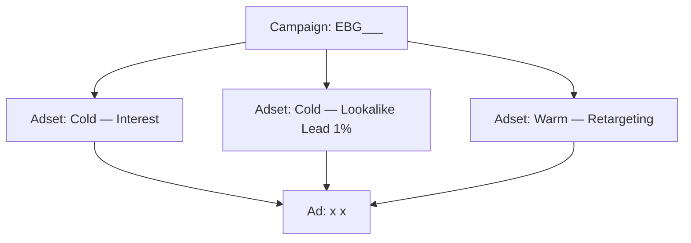

# 06 — Targeting quảng cáo

> Nguồn: `src/lib/lp-types.ts` (UTM, `LP_PROJECT_TYPES`, `LP_PROJECT_STAGES`,
> `LpFormKind`), `src/lib/lp-tracking.ts` (4 event), `src/lib/lp-content.ts` (3 biến thể
> LP), `src/lib/color-tones.ts`, `src/lib/types.ts` (`SPACE_TYPES`), `src/lib/lp-consent.ts`
> (GTM `GTM-P4SQ7HBB`, cookie `ebg_gtm_consent`).

## 0. Bối cảnh kỹ thuật (đọc trước khi chạy camp)

### Chính sách giá công khai — CHỐT: **không public giá**

> **Quyết định:** không đưa giá lên bất kỳ bề mặt công khai nào (LP, ads, content, thư viện).
>
> **Vì sao:** CRM có 3 tầng giá (`retail_price`, `trade_price`, `b2b_price`) + VAT 8%
> (`docs/nghiep-vu.md` §Báo giá, §VAT 8%). Giá bán phụ thuộc **dòng, khổ, số lượng và
> đối tượng** — một con số công khai sẽ sai cho gần hết khách. `LpMaterial` (public-safe)
> **cố ý không có** `retail_price`/`trade_price`/`b2b_price` (`src/lib/lp-types.ts`).
>
> **Hệ quả cho ads/content:**
> - **Không** chạy camp nhắm "giá rẻ", "báo giá", "so giá".
> - Mọi CTA giá → dẫn về **"gửi brief để nhận báo giá đúng nhóm"**.
> - Objection "cho xin bảng giá" → xem kịch bản ở `05` §7.

| Thành phần | Giá trị | Ý nghĩa cho ads |
|---|---|---|
| GTM container | `GTM-P4SQ7HBB` | Nơi cấu hình tag; **chỉ nạp sau khi khách đồng ý cookie** |
| Cookie đồng thuận | `ebg_gtm_consent` = `granted`/`denied` | Chưa chọn ⇒ **không có pixel, không có số liệu** |
| Meta Pixel | bắn qua `fbq` (do GTM định nghĩa) | **Phải tạo tag trong GTM** |
| GA4 | bắn qua `gtag` (do GTM định nghĩa) | **Phải tạo tag trong GTM** |
| Event đang bắn | `ViewContent`, `AddToCart`, `Lead` (dịch tên riêng cho Meta và GA4) | Xem `07` §1 |
| Biến thể LP | `/` (= gach-trang-tri), `/lp/gach-the`, `/lp/mosaic` | Mỗi camp dùng 1 slug |

> ✅ **ĐÃ SỬA (2026-09-29) — container đã publish.** Ghi chú cũ (đo 2026-09-28:
> `"tags":[]`) đã lỗi thời. `GTM-P4SQ7HBB` giờ có tag Meta Pixel `1086936020738731`;
> kiểm chứng bằng browser: `window.fbq` = function, script
> `connect.facebook.net/signals/config/1086936020738731` nạp thật. Pixel nhận event
> thật (30 ngày: PageView, ViewContent, Lead). **Chạy camp được, event bắn được.**
> Vẫn nên mở thử 1 ad rồi kiểm `fbq`/`lp_leads` để xác nhận sau khi publish.

> ⚠️ **Thanh đồng thuận KHÔNG chặn.** Đây là thanh **neo đáy** (`z-index: 95`), khách vẫn
> cuộn và dùng trang bình thường; bỏ qua ⇒ GTM không nạp ⇒ **không có dữ liệu pixel cho
> phiên đó**. Vì vậy số liệu ads luôn thấp hơn thực tế một phần. Đừng tối ưu dựa trên số
> tuyệt đối nhỏ — xem `07` §5.

## 1. Ai để target (theo persona)

| Persona | Target chính | Loại trừ |
|---|---|---|
| **A — KTS chủ trì** | Người quan tâm kiến trúc & thiết kế nội thất | Khách lẻ, sinh viên |
| **B — Studio hoàn thiện** | Chủ doanh nghiệp nhỏ, người dùng phần mềm thiết kế | Cá nhân mua lẻ |
| **C — Chủ đầu tư có gu** | Người quan tâm BĐS cao cấp, nội thất | Khách tìm giá rẻ |

> ⚠️ **Meta đã bỏ targeting theo chức danh/nghề nghiệp (job title) và nơi làm việc** khỏi
> detailed targeting. **Không thể** chọn "kiến trúc sư" như một interest trong Ads Manager.
> Phải dùng các **surrogate reachable** dưới đây. Chức danh chỉ dùng làm **góc creative**,
> không phải thông số target.

### Interest / behavior dùng được (Meta)

- **Sở thích:** Kiến trúc · Thiết kế nội thất · Thiết kế · Xây dựng · Vật liệu xây dựng ·
  Trang trí nội thất · Bất động sản · Nhà ở · Đồ nội thất.
- **Phần mềm thiết kế (vẫn còn là interest):** SketchUp · AutoCAD · 3ds Max · Revit ·
  Enscape · Behance · Pinterest.
- **Hành vi:** chủ doanh nghiệp nhỏ (small business owners) · người dùng thiết bị cao cấp ·
  người mua B2B.
- **Tương tác Page/Group:** người đã tương tác với page `fb.com/embangach`; remarketing
  từ nhóm ngành (nếu có).

### Lookalike — chỉ dựng khi đủ seed

- **Nguồn tốt nhất:** `Lead` (form brief) — nhưng **phải có ≥ ~100 seed** trong một quốc gia
  thì Meta mới dựng được LAL 1%.
- **Nguồn bổ sung:** `AddToCart` (lưu mã) — volume lớn hơn `Lead`.
- **Không có event nào cho "mở thư viện"** — luồng đó đi qua Google OAuth, không qua `trackEvent` (xem `07` §1).
- **Chưa đủ seed** ⇒ chạy interest-based trước, tích luỹ rồi mới bật LAL.

## 2. Cấu trúc campaign (khuyến nghị)



### Quy ước đặt tên

> **Chuẩn: chữ thường, không dấu, gạch dưới.** Tên trên nền tảng ads (Meta/TikTok) có thể
> viết khác để dễ đọc, nhưng **chuỗi UTM là thứ nối vào `lp_leads`** — nó phải đóng băng và
> khớp chính xác. Đặt UTM theo đúng template dưới đây, không đổi hoa/thường giữa hai chỗ.

```
Campaign:  ebg_<dòng>_<mục tiêu>_<tháng>
Adset:     ebg_<dòng>_<audience>_<geo>
Ad:        ebg_<dòng>_<bối cảnh>_<format>

Ví dụ:
Campaign:  ebg_mosaic_lead_202610
Adset:     ebg_mosaic_lal-lead-1p_hcm
Ad:        ebg_mosaic_quaybar_carousel
```

| Thành phần | Giá trị hợp lệ |
|---|---|
| `<dòng>` | `gachthe` · `mosaic` · `gachbong` · `oplat` · `chung` |
| `<mục tiêu>` | `reach` · `traffic` · `lead` · `retarget` |
| `<audience>` | `interest` · `lal-lead-1p` · `retarget-view` · `retarget-atc` |
| `<geo>` | `hcm` · `hn` · `tinh` · `vn` |
| `<bối cảnh>` | `quaybar` · `phongtam` · `sanvuon` · `matien` · `phongkhach` |
| `<format>` | `image` · `carousel` · `reel` · `video` |

## 3. Ba track theo biến thể LP

Mỗi track trỏ tới **một URL riêng** — không dùng chung link:

| Track | Landing URL | Ưu tiên | Ngân sách gợi ý |
|---|---|---|---|
| **Chung (gạch trang trí)** | `https://<domain>/` | Mở rộng, test creative | 30% |
| **Gạch thẻ** | `https://<domain>/lp/gach-the` | Persona A, tường nhấn | 35% |
| **Mosaic** | `https://<domain>/lp/mosaic` | Persona A/B, quầy/bếp/mặt nước | 35% |

> 🚨 **Không dùng `/lp/gach-trang-tri` cho track chung.** Slug mặc định bị **301 redirect
> về `/`**, và redirect này **làm mất query string** ⇒ UTM bị strip trước khi trang load
> ⇒ mọi lead Track-1 về với UTM rỗng. Dùng thẳng `/` — nó render đúng cùng
> `ArchitectLanding` và vẫn đọc `window.location.search`.

> Track gạch bông & ốp lát: **chưa có LP riêng** — nếu muốn chạy, thêm biến thể vào
> `LP_VARIANTS` trước (một entry, không cần route mới).

## 4. UTM — bắt buộc, theo chuẩn

LP đọc UTM từ query string và lưu vào `lp_leads` (cột `utm_source`, `utm_medium`,
`utm_campaign`, `utm_content`, `utm_term`) — **nhưng chỉ cho lead `form_kind='lp'`**
(brief). Lead `google-unlock` (mở thư viện) insert **không có UTM** (xem `07` §7).

> **Không có UTM = không biết camp nào ra lead.**

### Template — theo từng track

🚨 **Track chung KHÔNG có `<slug>`.** Chỉ track gạch thẻ / mosaic mới có slug:

```
Track chung:   https://<domain>/?utm_source=<platform>&utm_medium=paid&utm_campaign=<camp>&utm_content=<ad>
Track gạch thẻ: https://<domain>/lp/gach-the?utm_source=...&utm_content=...
Track mosaic:   https://<domain>/lp/mosaic?utm_source=...&utm_content=...
```

| Param | Giá trị | Ví dụ |
|---|---|---|
| `utm_source` | Nền tảng | `facebook` · `tiktok` · `google` · `zalo` |
| `utm_medium` | Loại | `paid` · `organic` · `email` · `social` |
| `utm_campaign` | Tên camp | `ebg_mosaic_lead_202610` |
| `utm_content` | Định danh ad | `quaybar_carousel_v1` |
| `utm_term` | Tùy chọn — keyword/audience | `lal-lead-1p` · `kts-hcm` |

> **4 param là bắt buộc; `utm_term` là tùy chọn.** `utm_term` không được Meta/TikTok tự
> điền ⇒ dễ quên/sai. Chỉ dùng khi thật cần phân biệt audience; **ưu tiên định danh ad
> trong `utm_content`**.

### Về URL macro (`{{ad.name}}`) — cẩn thận

Meta có hỗ trợ dynamic parameter, nhưng **có hai cái bẫy**:

1. **Nhập qua UI "URL parameters" của Ads Manager**, không gõ tay vào Final URL — gõ tay
   thường bị URL-encode thành `%7B%7Bad.name%7D%7D` và **không được thay**.
2. Meta **không phải lúc nào cũng thay macro trong query string** khi URL đã bị encode.
   Phải **test thật một ad** rồi kiểm `lp_leads.utm_content` xem có giá trị đúng không.

> **Khuyến nghị an toàn:** mặc định **gõ tay `utm_content`** cho từng ad (một chuỗi ngắn,
> duy nhất). Chỉ chuyển sang macro sau khi **đã verify** nó thay đúng trong `lp_leads`.

### Ví dụ đầy đủ (gõ tay)

```
https://embangach.com/lp/mosaic?utm_source=facebook&utm_medium=paid&utm_campaign=ebg_mosaic_lead_202610&utm_content=quaybar_carousel_v1&utm_term=lal-lead-1p
```

### Luật UTM

1. **Chữ thường, không dấu, gạch dưới** giữa các từ.
2. **Không đổi tên camp sau khi chạy** — lead cũ sẽ lệch.
3. Mỗi ad = một `utm_content` **duy nhất**.
4. Link bio/organic cũng phải có UTM (`utm_medium=organic|social`).
5. **Track chung dùng `/` (không slug)** — `/lp/gach-trang-tri` 301 và strip query.
6. Với lead `google-unlock`, UTM **không** được ghi — đừng kỳ vọng báo cáo UTM phủ nhóm này.

## 5. Cấu trúc audience theo funnel

| Tầng | Audience | Nguồn dựng | Creative |
|---|---|---|---|
| **Cold** | Interest kiến trúc/nội thất/vật liệu | Meta interest | P1, P2 (cảm hứng) |
| **Cold** | Lookalike 1% từ `Lead` | Pixel (**cần ≥ ~100 seed**) | P4 (case study) |
| **Warm** | Retarget `ViewContent` 30 ngày | Pixel | P3, P5 (kiến thức, offer) |
| **Warm** | Retarget `AddToCart` 14 ngày | Pixel | "Shortlist của bạn còn đó" |
| **Hot** | Lead cũ trong CRM | Truy vấn DB + hash SĐT/email | Email/Zalo chăm sóc |

> ⚠️ **Chưa có event cho tầng "mở thư viện"** — luồng đó đi qua Google OAuth, không qua
> `trackEvent` (`07` §1). Muốn có thì phải instrument trước.
>
> **Lưu ý về retargeting:** do consent model + container GTM rỗng, kích thước audience
> retarget **rất nhỏ hoặc bằng 0**. Nếu audience <1000, **dùng interest/lookalike thay vì
> retarget**. Xem `07` §5 trước khi kỳ vọng có số.
>
> **Lead cũ (CRM) là bước thủ công:** không có nút export trong CRM (`listLpLeads` cap
> 500 row/lần). Phải truy vấn DB rồi hash SĐT/email mới upload được lên nền tảng.

## 6. Loại trừ & giới hạn

| Loại trừ | Vì |
|---|---|
| Nhân viên, admin (IP/email) | Tránh nhiễu số liệu |
| **Khách hàng hiện hữu (CRM `customers`)** | Không chi tiền cho người đã mua — upload danh sách suppression |
| Lead đã `converted` | Không chi tiền lại |
| Lead `spam` | Chất lượng thấp |
| Nhóm "mua gạch giá rẻ" | Ngoài ICP |
| Tỉnh không có tuyến giao | Kiểm với vận hành trước |

## 7. Mapping creative ↔ audience (tránh lãng phí)

| Audience | Creative phù hợp | Creative **không** phù hợp |
|---|---|---|
| Interest kiến trúc/nội thất | Ảnh bề mặt, lookbook, kiến thức | Offer báo giá (quá sớm) |
| Lookalike Lead | Case study, deliverables | Ảnh macro đơn thuần |
| Retarget view | Kiến thức + offer mềm | Ảnh brand chung |
| Retarget ATC | "Mã bạn lưu còn đó" | Ảnh cảm hứng mới |

## 8. Checklist trước khi bật camp

- [ ] 🚨 **Container `GTM-P4SQ7HBB` đã có tag GA4 + Meta Pixel và đã Publish.** Không có
      bước này thì camp chạy mà **không thu được event nào** (xem §0).
- [ ] Đúng **URL** cho track — track chung dùng `/`, **không** `/lp/gach-trang-tri`.
- [ ] **UTM 4 param bắt buộc** (source/medium/campaign/content), đúng chuẩn chữ thường.
- [ ] Creative khớp audience (bảng §7).
- [ ] Đã set **loại trừ** (§6), gồm suppression khách hàng hiện hữu.
- [ ] Tên camp/adset/ad theo quy ước (§2).
- [ ] Landing page **không lỗi** — mở thử trên mobile trước khi chạy.
- [ ] Đã có baseline KPI để so (xem `07`).

## 9. Hợp đồng bàn giao MKT → Sales (`lp_leads`)

Đây là **những gì MKT thực sự nhận được** khi một lead đổ về — schema bảng `lp_leads`
(`src/db/schema-pg.sql`). Dùng bảng này để biết mình **đo được gì** và **thiếu gì**:

| Nhóm | Cột | Ghi chú cho MKT |
|---|---|---|
| Định danh | `full_name`, `phone`, `phone_norm`, `email` | `phone_norm` để gom trùng |
| Nhu cầu | `need`, `note`, `shortlist_codes` | **`shortlist_codes` = khách thích mã nào** — insight vàng |
| Nguồn | `lp_slug`, `utm_source/medium/campaign/content/term`, `referrer`, `landing_path` | Chỉ có với lead `form_kind='lp'` |
| Đồng thuận | `consent_marketing`, `consent_at` | **Đồng ý nhận email marketing** (khác cookie GTM) |
| Xử lý | `status`, `customer_id`, `handled_by`, `handled_at` | Vòng đời lead → khách hàng |
| Chống spam | `ip_hash`, `user_agent` | Chỉ hash, không lưu IP thô |

**Suy ra:**
- MKT **không** nhận được `project_type`, `project_stage`, `area`, `studio` dạng cột riêng —
  chúng nằm gộp trong `note`/`need`. Muốn phân tích theo loại công trình → phải đọc `note`.
- Muốn email marketing → **phải lọc `consent_marketing = 1`**.

## 10. Ma trận kênh (mở rộng ngoài Meta)

Hiện doc này mới phủ Meta. Với thị trường VN, bổ sung theo tầng:

| Kênh | Tầng | Vai trò | Ghi chú |
|---|---|---|---|
| **Meta (FB/IG)** | Top + Mid | Kênh chính, ảnh là vũ khí | Doc này tập trung ở đây |
| **TikTok** | Top | Video bề mặt, "1 ảnh = 1 mã" | Persona A trẻ, chủ đầu tư C |
| **Google Search** | Bottom | **Bắt nhu cầu có sẵn** ("gạch thẻ ốp tường", "mosaic hồ bơi", "gạch terracotta") | Chưa khai thác — high-intent |
| **Zalo Ads** | Mid + Bottom | Kênh B2B/nhà thầu bản địa, rất mạnh ở VN | Chưa khai thác |
| **Pinterest** | Top | Moodboard, lookbook — persona A/C | `02` §2 liệt kê là nơi persona ở |
| **YouTube** | Top + Mid | Video dài, case study công trình | Tùy nguồn lực sản xuất |

> **Ưu tiên mở rộng:** Google Search cho **bắt nhu cầu** (bottom-funnel) và Zalo cho
> **kênh bản địa** — hai chỗ trống lớn nhất so với hành vi thật của khách VN.

## 11. Điểm mù của phễu (đã biết)

| Điểm mù | Hệ quả | Cách xử lý |
|---|---|---|
| Không có event giữa `AddToCart` và `Lead` | Không biết bao nhiêu người **bắt đầu điền form rồi bỏ** | Thêm event kiểu `InitiateCheckout` khi focus field đầu, hoặc chấp nhận mù |
| Không có event "mở thư viện" | Không đo được lượt mở thư viện | Instrument `trackEvent` ở nhánh unlock thành công trước khi dựng audience |
| UTM chỉ phủ lead `lp` | Lead `google-unlock` không gắn được camp | Ghi nhận giới hạn, hoặc instrument UTM cho OAuth |

## 12. Điều KHÔNG làm

| ❌ | Vì |
|---|---|
| Bật camp khi container GTM còn rỗng | Không thu được event nào — mù hoàn toàn |
| Chạy camp khi chưa có UTM | Lead về mà không biết nguồn |
| Dùng `/lp/gach-trang-tri` cho track chung | 301 strip UTM ⇒ lead về UTM rỗng |
| Dùng cùng link cho 3 track | Không biết dòng nào hiệu quả |
| Target theo chức danh "kiến trúc sư" | Meta đã bỏ — không chọn được |
| Dựng audience cho tầng "mở thư viện" | Không có event nào ⇒ audience rỗng |
| Tối ưu theo "giá rẻ" | Phá định vị, hút sai khách |
| Chạy retarget với audience quá nhỏ | Không phân phối được |
| Đổi tên camp giữa chiến dịch | Vỡ dữ liệu lịch sử |
